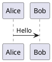
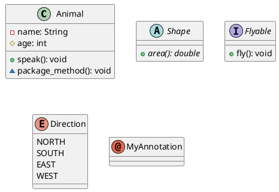
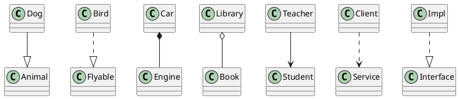
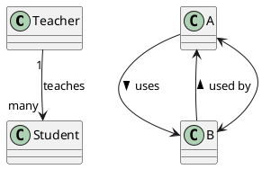
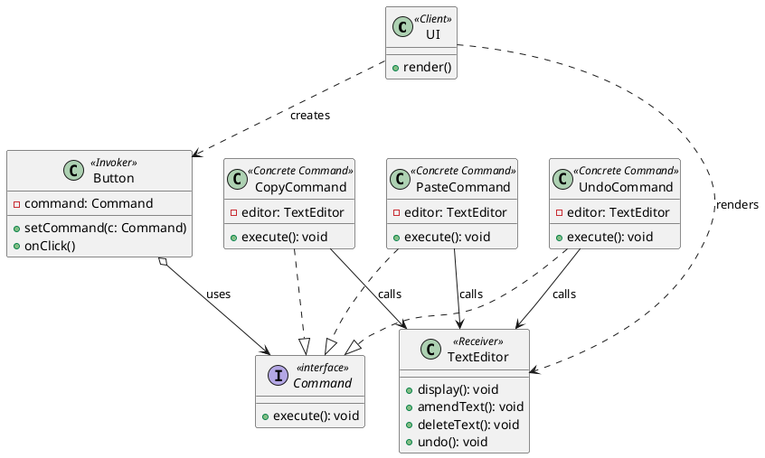

# PlantUML Cheatsheet

## Table of Contents

1. [Getting Started](#getting-started)
2. [Class Diagrams](#class-diagrams)
3. [Sequence Diagrams](#sequence-diagrams)
4. [Use Case Diagrams](#use-case-diagrams)
5. [Activity Diagrams](#activity-diagrams)
6. [Component Diagrams](#component-diagrams)
7. [State Diagrams](#state-diagrams)
8. [Skinparam & Styling](#skinparam--styling)
9. [Worked Example — Command Pattern](#worked-example--command-pattern)

---

## Getting Started

Every diagram is wrapped in `@startuml` / `@enduml`.

---

## Class Diagrams

### Declaring Classes

### Visibility Modifiers

| Symbol | Visibility |
| ------ | ---------- |
| `-`    | private    |
| `#`    | protected  |
| `+`    | public     |
| `~`    | package    |

### Relationships

### Relationship Labels & Multiplicity

---

## Worked Example — Command Pattern

The diagram below maps directly to the GoF Command pattern as applied to a text editor, with the full tabular mapping:

| GoF Term         | Our Design     |
| ---------------- | -------------- |
| Client           | `UI`           |
| Invoker          | `Button`       |
| Command          | `Command`      |
| Concrete Command | `CopyCommand`  |
| Concrete Command | `PasteCommand` |
| Concrete Command | `UndoCommand`  |
| Receiver         | `TextEditor`   |

### Arrow Quick Reference

| Syntax | Meaning                        | Line style             |
| ------ | ------------------------------ | ---------------------- | ------------------ |
| `--    | >`                             | Inheritance / extends  | solid + filled tri |
| `..    | >`                             | Implements interface   | dashed + open tri  |
| `-->`  | Association / calls            | solid arrow            |
| `..>`  | Dependency / creates           | dashed arrow           |
| `o-->` | Aggregation (weak ownership)   | solid + open diamond   |
| `*-->` | Composition (strong ownership) | solid + filled diamond |
| `<-->` | Bidirectional association      | solid double arrow     |

> **Tip:** Reverse any arrow by flipping the direction: `B --|> A` draws the triangle pointing at A.
